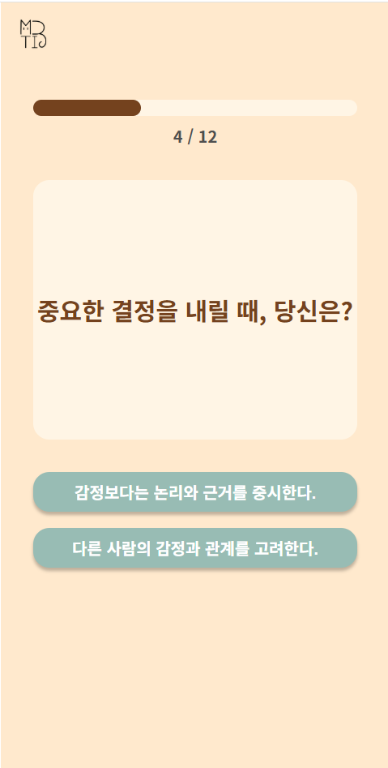
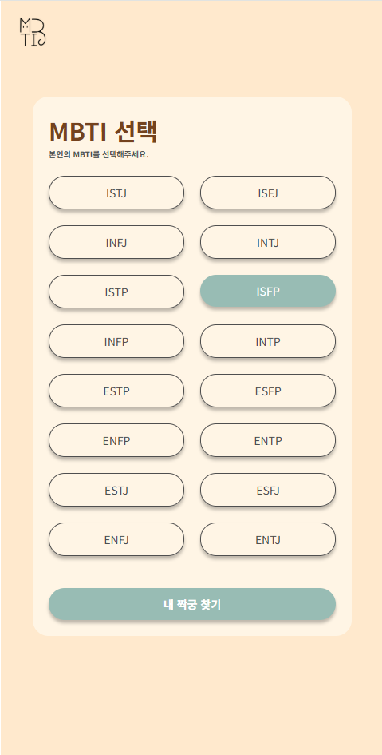
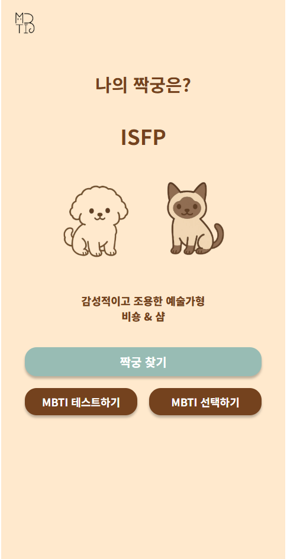
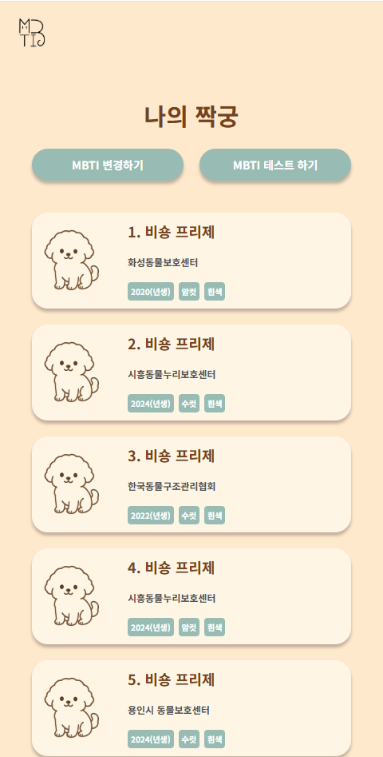
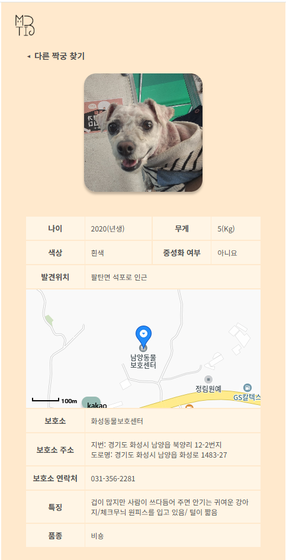

# HuggyType


## 0. 목차

1.  [프로젝트 소개](#1-프로젝트-소개)
2.  [기술 개발 구현](#2-기술-개발-구현)
3.  [기술 스택](#3-기술-스택)
4.  [코딩 컨벤션](#4-코딩-컨벤션)
5.  [시연 이미지](#5-시연-이미지)
6.  [폴더 구조](#6-폴더-구조)
7.  [미래 개선 방향](#7-미래-개선-방향)
8.  [성과 및 느낀 점](#8-성과-및-느낀-점)
<br>

## 1. 프로젝트 소개
반려동물을 가족처럼 아끼는 문화가 자리잡는 요즘, 입양은 더 쉬워졌지만 버려지는 유기동물의 수는 여전히 줄지 않고 있습니다. 해마다 10만 마리 이상의 유기동물이 구조되고 있지만, 그 중 많은 수가 끝내 새 가족을 만나지 못한 채 보호소를 떠나게 됩니다.

우리는 이 문제를 `궁합`에서부터 다시 생각했습니다.

사람과 동물, 그 관계 역시 서로의 성향과 잘 맞을 때 비로소 오래 이어질 수 있습니다. 그래서 탄생한 것이 바로 이 플랫폼, 포옹타입입니다. 사용자의 MBTI 성향을 분석해, 잘 어울리는 유기견과 유기묘의 품종을 추천하고, 실제로 보호소에 보호 중인 유기동물들과의 입양 연결까지 돕는 이 플랫폼은 단순한 입양이 아닌, 진짜 가족을 찾는 여정입니다.

이제 더 많은 유기동물에게, 그리고 새로운 가족을 기다리는 당신에게 맞춤형 인연을 선물합니다.

<br>배포 URL: https://5647kr.github.io/huggytype/
<br>
<br>


## 2. 기술 개발 구현

### 1. MBTI 테스트 기능 구현
<br>
복잡한 방법의 MBTI테스트 결과 계산이 아닌 간단한 방식으로 MBTI 유형을 파악할 수 있게끔 유형검사를 진행합니다.
<br>
<br>

```

  const [testNum, setTestNum] = useState(1);
  const testList = [...mbtiQuestion];
  const [ei, setEi] = useState(0);
  const [ns, setNs] = useState(0);
  const [tf, setTf] = useState(0);
  const [jp, setJp] = useState(0);

<!-- 다음 질문 이동 및 결과 -->
  function nextQuestion() {
    if (testNum === 12) {
      resultMBTI();
    } else {
      setTestNum(testNum + 1);
    }
  }

<!-- A 버튼 클릭시 타입별 1점 추가 -->
  function clickedA() {
    const type = testList[testNum - 1].type.toLowerCase();
    if (type === "ei") {
      setEi(ei + 1);
    } else if (type === "ns") {
      setNs(ns + 1);
    } else if (type === "tf") {
      setTf(tf + 1);
    } else {
      setJp(jp + 1);
    }

    nextQuestion();
  }

<!-- B 버튼 클릭시 다음 질문 이동 -->
  function clickedB() {
    nextQuestion();
  }

<!-- 최종 2점 이상인 타입 조합하여 변수에 저장 후 result 페이지로 전달 -->
  function resultMBTI() {
    let result = "";
    result += ei >= 2 ? "E" : "I";
    result += ns >= 2 ? "N" : "S";
    result += tf >= 2 ? "T" : "F";
    result += jp >= 2 ? "J" : "P";

    navigate("/result", { state: { mbti: result } });
  }

```
<br>
<br>

### 2. Axios + Zustand를 이용한 API 통신
<br>
현재 대한민국에서 제공하고 있는 경기도 유기동물 API를 이용했으며, Axios와 Zustand를 이용해 데이터 관리를 진행하였습니다. 또한 API 특성상 Type를 동시에 2개를 요청할 수 없어 반복문을 이용해 유기견, 유기묘의 데이터를 배열에 담아 zustand에 저장합니다.
<br>

```
import axios from "axios";
import { create } from "zustand";

export const usePetListStore = create((set) => ({
  petList: [],

  getPetListData: async (types) => {
    const apiUrl = "https://openapi.gg.go.kr/AbdmAnimalProtect";

    const petListData = []; // 예: ["비숑", "샴"]

    for (let i = 0; i < types.length; i++) {
      const type = encodeURIComponent(types[i]);

      const url = `${apiUrl}?key=${key}&type=json&STATE_NM=보호중&SPECIES_NM=${type}`;

      try {
        const response = await axios.get(url);
        const data = response.data.AbdmAnimalProtect?.[1].row || [];

        petListData.push(...data);
      } catch (error) {
        console.error(error);
      }
    }

    set({ petList: petListData });
  },
}));

```
<br>
<br>

## 3. 기술 스택

<table>
  <tr>
    <td align="center" width="100px">사용 기술</td>
    <td width="800px">
      &nbsp
      &nbsp 
      &nbsp 
      &nbsp 
      &nbsp 
    </td>
  </tr>
  <tr>
    <td align="center">기술 도구</td>
    <td>
      &nbsp 
      
    </td>
  <tr>
  <tr>
    <td align="center">API</td>
    <td>
      &nbsp &nbsp
    </td>
  <tr>
    <td align="center">디자인</td>
    <td>
      &nbsp  
    </td>
  </tr>
  <tr>
    <td align="center">IDE</td>
    <td>
      &nbsp
  </tr>
</table>

<br>

## 4. 코딩 컨벤션

<br>

<detail>
  <table>
    <tr>
      <th>커밋 유형</th>
      <th>커밋 메세지</th>
      <th>의미</th>
    </tr>
    <tr>
      <td>✨</td>
      <td>Feat</td>
      <td>새로운 기능 추가</td>
    </tr>
    <tr>
      <td>🐛</td>
      <td>Fix</td>
      <td>버그 & 에러 수정</td>
    </tr>
    <tr>
      <td>📝</td>
      <td>File</td>
      <td>리드미 등 문서 수정, 라이브러리 설치</td>
    </tr>
    <tr>
      <td>🎨</td>
      <td>Style</td>
      <td>코드 포맷팅, 세미콜론 누락, 코드 변경이 없는 경우</td>
    </tr>
    <tr>
      <td>🖌</td>
      <td>Design</td>
      <td>UI 디자인 변경</td>
    </tr>
    <tr>
      <td>🔨</td>
      <td>Refactor</td>
      <td>코드 리팩토링</td>
    </tr>
    <tr>
      <td>🤔</td>
      <td>Test</td>
      <td>테스트 코드, 리팩토링 테스트 코드 추가</td>
    </tr>
    <tr>
      <td>⚙</td>
      <td>Chore</td>
      <td>빌드 업무 수정, 패키지 매니저 수정</td>
    </tr>
    <tr>
      <td>🗒</td>
      <td>Rename</td>
      <td>파일명 혹은 폴더명 수정, 위치 옮기기</td>
    </tr>
    <tr>
      <td>🔥</td>
      <td>Remove</td>
      <td>파일 삭제</td>
    </tr>
  </table>
</detail>

<br>
<br>


## 5. 시연 이미지


|                                                                  홈                                                                  |                                                                 MBTI 테스트                                                                  |                                                                       MBTI 검색                                                                       |
| :-----------------------------------------------------------------------------------------------------------------------------------------------: | :----------------------------------------------------------------------------------------------------------------------------------------------: | :----------------------------------------------------------------------------------------------------------------------------------------------: |
 |  |  | 


|                                                                    결과 화면                                                                    |                                                                   짝궁 리스트                                                                    |                                                                 짝궁 상세                                                                  |
| :-----------------------------------------------------------------------------------------------------------------------------------------------: | :----------------------------------------------------------------------------------------------------------------------------------------------: | :----------------------------------------------------------------------------------------------------------------------------------------------: |
|  |  |  |


<br>
<br>

## 6. 폴더 구조

```
📦public
 ┣ 📂assets
 ┃ ┣ 📂img
 ┃ ┗ 📂readmeImg
 📦src
 ┣ 📂api
 ┣ 📂components
 ┃ ┣ 📜Button.jsx
 ┃ ┣ 📜Common.jsx
 ┃ ┣ 📜Header.jsx
 ┃ ┗ 📜KakakoMap.jsx
 ┣ 📂data
 ┃ ┗ 📜Data.jsx
 ┣ 📂pages
 ┃ ┣ 📂FindMyPet
 ┃ ┃ ┣ 📂Detail
 ┃ ┃ ┃ ┗ 📜FindMyPetDetail.jsx
 ┃ ┃ ┗ 📜FindMyPet.jsx
 ┃ ┣ 📂Home
 ┃ ┃ ┗ 📜Home.jsx
 ┃ ┣ 📂Result
 ┃ ┃ ┗ 📜Result.jsx
 ┃ ┣ 📂Search
 ┃ ┃ ┗ 📜Search.jsx
 ┃ ┗ 📂Test
 ┃ ┃ ┗ 📜Test.jsx
 ┣ 📂store
 ┃ ┗ 📜UsePetListStore.jsx
 ┣ 📂style
 ┃ ┣ 📜fonts.css
 ┃ ┗ 📜GlobalStyle.jsx
 ┣ 📜App.js
 ┗ 📜index.js

```


<br>
<br>


## 7. 미래 개선 방향

### 1. 회원가입 및 로그인을 통한 유저 관리
회원가입 및 로그인 기능 구현을 통해 유저를 받아 유기동물 찜목록 또는 입양 신청을 통해 보호소가 받을 수 있도록 기능을 확장할 계획을 가지고 있습니다. 개인적으로 백엔드 학습 이후 기능을 확장할 계획을 가지고 있습니다.

### 2. TypeScript로의 리펙토링 & 이미지 레이지로딩
최근 유행하는 TypeScript를 적용해 안정성과 코드 벨류를 향상시킬 계획을 가지고 있으며, 기회가 된다면 이미지 레이지로딩 또한 적용하여 부드러운 사용자 경험을 향상시키고 싶습니다.


<br>
<br>

## 8. 성과 및 느낀 점

이번 프로젝트를 통해 Axois와 zustand를 사용하였습니다. 확실히 공공데이터 API를 통해 Axios및 async await를 익숙해지는 계기가 되었습니다. 이러한 기회를 통해 백엔드에 관심이 생겼고 node.js 학습을 통한 백엔드를 만들어 하나의 풀스택 프로젝트를 경험할 수 있는 기회를 가지고 싶습니다.
